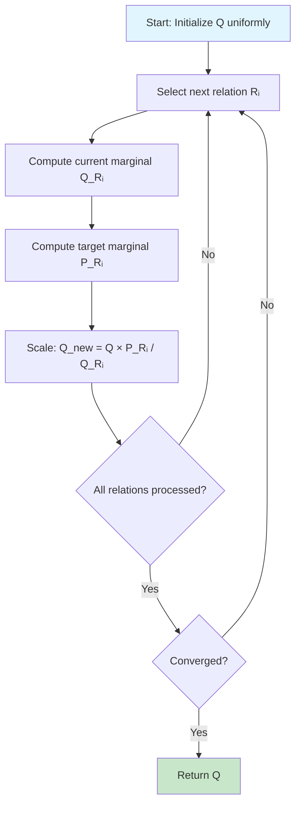
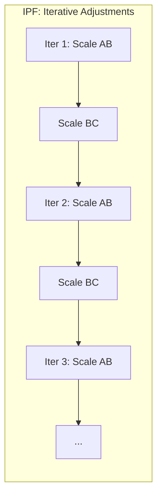
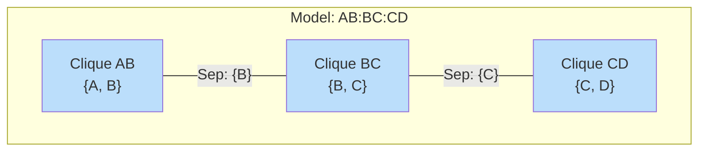
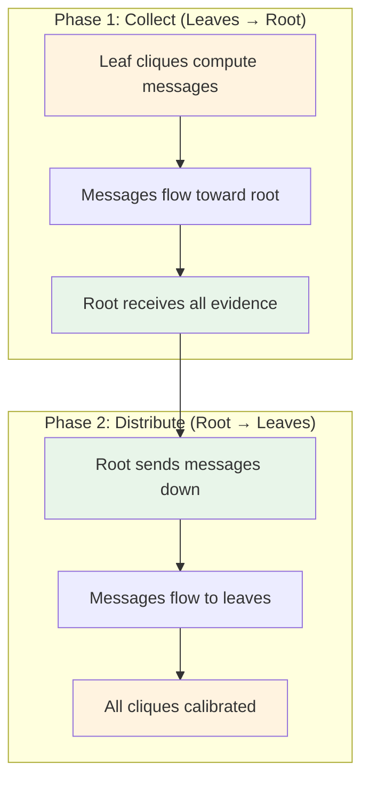
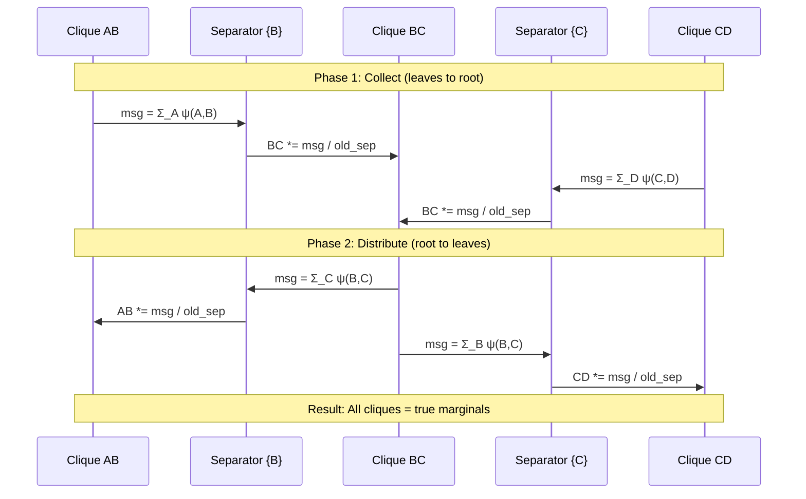
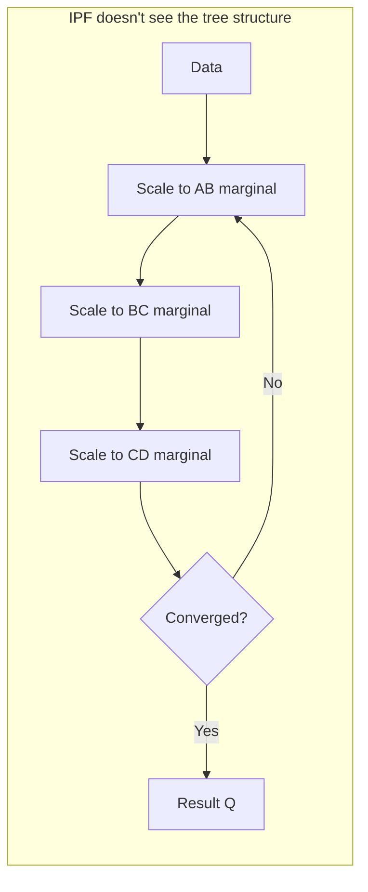
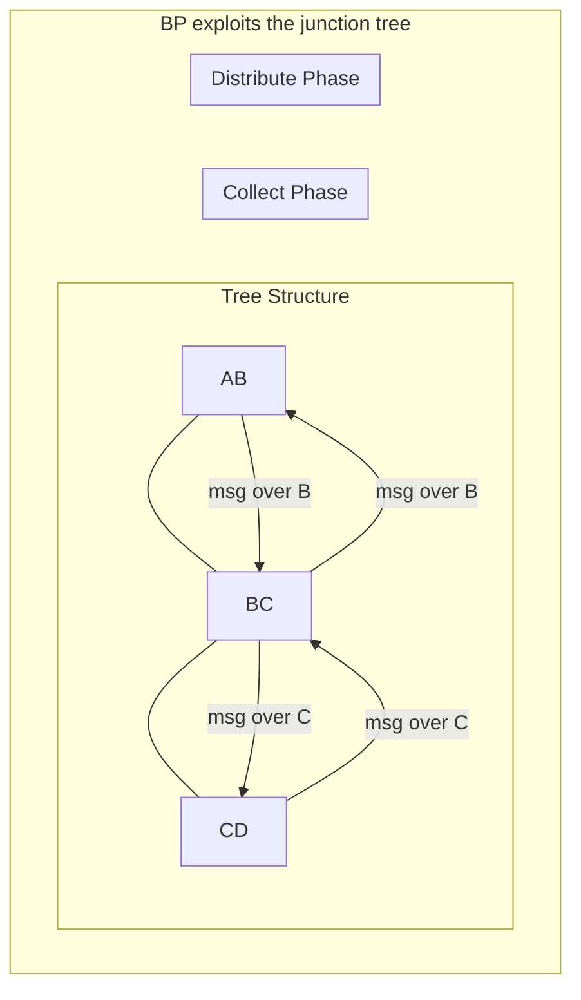
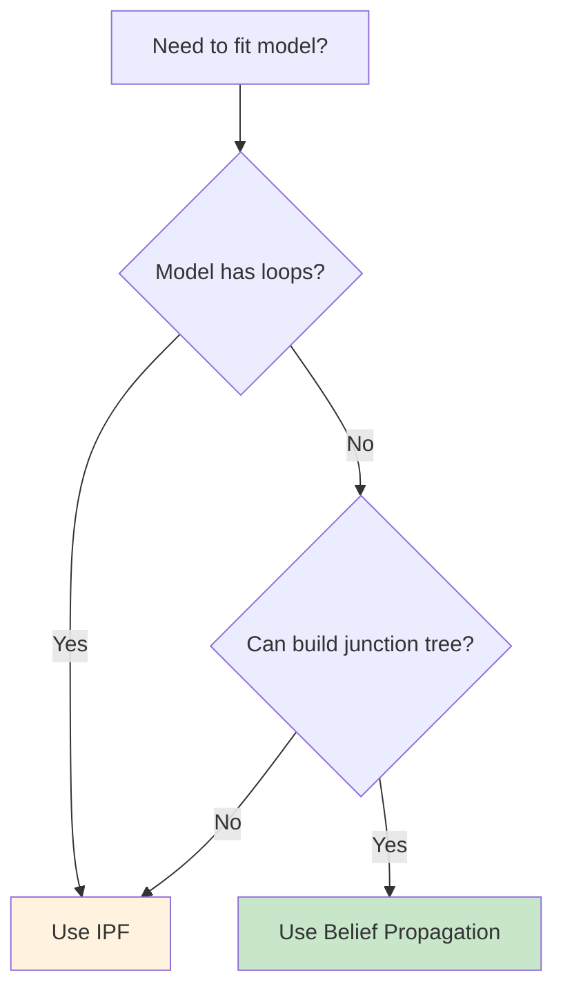
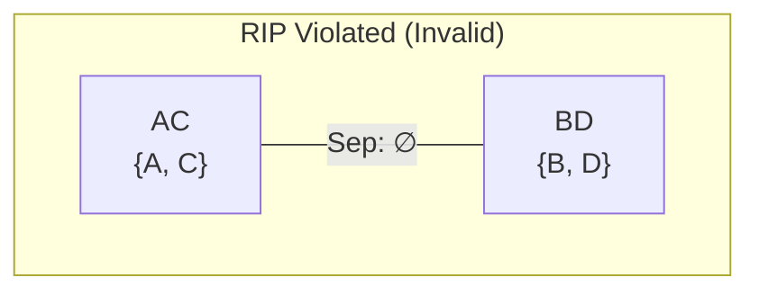
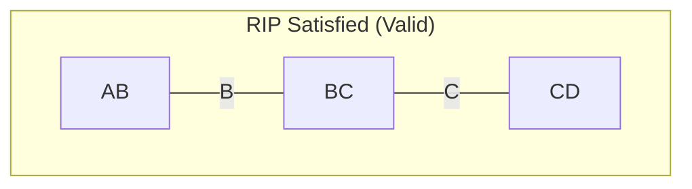

# IPF vs Belief Propagation: Fitting Decomposable Models

This document compares two algorithms for fitting probability distributions to decomposable (loopless) graphical models:
1. **Iterative Proportional Fitting (IPF)** - the classical iterative approach
2. **Belief Propagation (BP)** on Junction Trees - the modern exact inference approach

## Executive Summary

| Aspect | IPF | Belief Propagation |
|--------|-----|-------------------|
| **Complexity** | O(iterations × cliques × states) | O(cliques × states) |
| **Iterations** | Variable (until convergence) | Always 2 passes |
| **Exactness** | Converges to exact solution | Exact in single pass |
| **Loop Models** | ✅ Works (may not converge) | ❌ Requires loopless |
| **Our Speedup** | Baseline | **5.15x faster** (average) |

---

## Part 1: The Problem

Given observed data P(X₁, X₂, ..., Xₙ) and a model structure (set of relations/cliques), we want to find the **maximum entropy distribution** Q that:
1. Matches the observed marginals for each clique
2. Makes no other assumptions (maximum entropy principle)

### Example: Chain Model AB:BC

```
Variables: A, B, C (each binary)
Model: AB:BC (A-B relationship, B-C relationship, no direct A-C)

Observed data P(A,B,C):
┌─────┬─────┬─────┬────────┐
│  A  │  B  │  C  │ P(ABC) │
├─────┼─────┼─────┼────────┤
│  0  │  0  │  0  │  0.25  │
│  0  │  0  │  1  │  0.05  │
│  0  │  1  │  0  │  0.10  │
│  0  │  1  │  1  │  0.15  │
│  1  │  0  │  0  │  0.05  │
│  1  │  0  │  1  │  0.10  │
│  1  │  1  │  0  │  0.15  │
│  1  │  1  │  1  │  0.15  │
└─────┴─────┴─────┴────────┘

Goal: Find Q(A,B,C) such that:
  - Q(A,B) = P(A,B)  (AB marginal preserved)
  - Q(B,C) = P(B,C)  (BC marginal preserved)
  - Q has maximum entropy given these constraints
```

---

## Part 2: Iterative Proportional Fitting (IPF)

### Conceptual Overview

IPF is like **adjusting a table repeatedly** until all row and column totals match the target. It cycles through each constraint, adjusting the distribution to match that marginal, then moves to the next.



### Algorithm

```
IPF(data, relations):
    Q ← uniform distribution

    repeat until convergence:
        for each relation R in relations:
            # Current marginal over R's variables
            Q_R ← marginalize(Q, R.variables)

            # Target marginal from observed data
            P_R ← marginalize(data, R.variables)

            # Scale Q to match P_R on these variables
            for each state s in Q:
                r ← project(s, R.variables)
                Q[s] ← Q[s] × P_R[r] / Q_R[r]

    return Q
```

### Why IPF Works

IPF is guaranteed to converge to the unique maximum entropy distribution because:
1. Each scaling step is a **Bregman projection** onto a constraint set
2. The constraint sets form an **affine subspace**
3. Cyclic projections converge to the intersection

### The Problem with IPF

**IPF doesn't know the model structure.** It treats each relation independently and iterates until the adjustments stabilize. For a decomposable model, this is wasteful:



Each iteration might undo some of what the previous one did, requiring multiple passes to find equilibrium.

---

## Part 3: Junction Trees and Belief Propagation

### What is a Junction Tree?

A **junction tree** (or clique tree) is a tree structure where:
- Each **node** is a clique (relation) from the model
- Each **edge** has a **separator** (shared variables between adjacent cliques)
- The **Running Intersection Property (RIP)** holds: for any variable, the cliques containing it form a connected subtree



### Key Insight: Factorization

For decomposable models, the joint distribution **factorizes** over the junction tree:

$$P(X) = \frac{\prod_i P(C_i)}{\prod_j P(S_j)}$$

Where:
- $C_i$ are the cliques
- $S_j$ are the separators

**This means we can compute the joint directly from marginals - no iteration needed!**

### Belief Propagation Algorithm

BP works in **two passes** through the tree:



### Message Passing in Detail



### Algorithm

```
BeliefPropagation(data, junction_tree):
    # Initialize clique potentials from observed marginals
    for each clique C:
        ψ[C] ← marginalize(data, C.variables)

    # Initialize separators to 1
    for each separator S:
        φ[S] ← 1

    # Phase 1: Collect (post-order: leaves before parents)
    for each clique C in post-order (skip root):
        parent ← C.parent
        sep ← separator(C, parent)

        message ← marginalize(ψ[C], sep.variables)
        old_sep ← φ[sep]
        φ[sep] ← message
        ψ[parent] ← ψ[parent] × message / old_sep

    # Phase 2: Distribute (pre-order: parents before children)
    for each clique C in pre-order:
        for each child in C.children:
            sep ← separator(C, child)

            message ← marginalize(ψ[C], sep.variables)
            old_sep ← φ[sep]
            φ[sep] ← message
            ψ[child] ← ψ[child] × message / old_sep

    return ψ  # Calibrated clique potentials
```

### Why BP is Better for Decomposable Models

1. **Exactly 2 passes** - no convergence checking needed
2. **Exploits structure** - messages flow along tree edges
3. **No redundant computation** - each variable updated exactly twice
4. **Numerically stable** - no iterative accumulation of errors

---

## Part 4: Visual Comparison

### IPF: Blind Iteration



IPF treats the model as a **black box** - just a set of constraints. It doesn't know that AB:BC:CD forms a chain.

### BP: Structured Message Passing



BP **uses the tree structure** to pass exactly the right information in exactly the right order.

---

## Part 5: Implementation in OCCAM-Nim

### Junction Tree Construction

```nim
# From src/occam/core/junction_tree.nim

proc buildJunctionTree*(model: Model; varList: VariableList): JunctionTreeResult =
  ## Build junction tree using maximum spanning tree on clique graph
  ## Edge weights = separator sizes (larger = better)

  # Build weighted edge list (separator size between each clique pair)
  for i in 0..<n:
    for j in (i+1)..<n:
      let sepSize = intersectionSize(model.relations[i], model.relations[j])
      if sepSize > 0:
        edges.add((-sepSize, i, j))  # Negative for max spanning tree

  # Kruskal's algorithm builds the tree
  for edge in edges.sorted():
    if union(edge.i, edge.j):  # Union-find for cycle detection
      treeEdges.add((edge.i, edge.j))

  # Verify Running Intersection Property
  for variable v:
    cliques_containing_v must form connected subtree
```

### Belief Propagation

```nim
# From src/occam/math/belief_propagation.nim

proc beliefPropagation*(inputTable: Table; jt: JunctionTree;
                        varList: VariableList): BPResult =

  # Initialize from observed marginals
  for i, clique in jt.cliques:
    result.cliquePotentials[i] = inputTable.project(varList, clique.varIndices)

  # Collect phase (post-order traversal)
  for cliqueIdx in jt.postOrder():
    if cliqueIdx == root: continue

    let message = marginalize(cliquePotentials[cliqueIdx], separator.variables)
    cliquePotentials[parent] *= message / oldSeparator
    separatorPotentials[sep] = message

  # Distribute phase (pre-order traversal)
  for cliqueIdx in jt.preOrder():
    for childIdx in jt.children[cliqueIdx]:
      let message = marginalize(cliquePotentials[cliqueIdx], separator.variables)
      cliquePotentials[child] *= message / oldSeparator
      separatorPotentials[sep] = message
```

### Integration in VBManager

```nim
# From src/occam/manager/vb.nim

proc makeFitTable*(mgr: var VBManager; model: Model): Table =
  if hasLoops(model, mgr.varList):
    # Non-decomposable: must use IPF
    let ipfResult = ipf.ipf(mgr.normalizedData, model.relations, mgr.varList)
    return ipfResult.fitTable
  else:
    # Decomposable: use fast belief propagation
    let jtResult = buildJunctionTree(model, mgr.varList)
    if jtResult.valid:
      let bpResult = bp.beliefPropagation(mgr.normalizedData, jtResult.tree, mgr.varList)
      return bp.computeJointFromBP(bpResult, jtResult.tree, mgr.varList)
    else:
      # Fallback to IPF if JT construction fails
      return ipf.ipf(mgr.normalizedData, model.relations, mgr.varList).fitTable
```

---

## Part 6: Benchmark Results

Running `nim c -r -d:release tests/benchmark_ipf_vs_bp.nim`:

```
==========================================================================================
BENCHMARK RESULTS: IPF vs Belief Propagation
==========================================================================================

Model                               IPF (ms)     BP (ms)   Speedup
------------------------------------------------------------------------------------------
Chain-3vars (AB:BC:...)                0.040       0.018     2.22x
Chain-4vars (AB:BC:...)                0.166       0.047     3.53x
Chain-5vars (AB:BC:...)                0.672       0.105     6.40x
Chain-6vars (AB:BC:...)                2.571       0.274     9.38x
Star-3vars (AB:AC:...)                 0.039       0.019     2.05x
Star-4vars (AB:AC:...)                 0.171       0.044     3.89x
Star-5vars (AB:AC:...)                 0.660       0.098     6.73x
Star-6vars (AB:AC:...)                 2.443       0.287     8.51x
Tree-4vars (AB:BC:BD)                  0.178       0.039     4.56x
Tree-6vars (AB:BC:CD:CE:EF)            2.526       0.294     8.59x
Chain-4vars card=4                     0.535       0.091     5.88x
Chain-4vars card=5                     1.322       0.191     6.92x
Chain-4vars card=6                     2.828       0.338     8.37x
------------------------------------------------------------------------------------------
Average speedup: 5.15x
```

### Speedup Trends

| Variables | Chain Speedup | Star Speedup |
|-----------|---------------|--------------|
| 3 | 2.2x | 2.0x |
| 4 | 3.5x | 3.9x |
| 5 | 6.4x | 6.7x |
| 6 | 9.4x | 8.5x |

**Key observations:**
- Speedup increases with model complexity
- 6-variable models: **8-9x faster**
- Higher cardinality variables: greater speedup
- Consistent across different tree structures

---

## Part 7: When to Use Which

### Use Belief Propagation When:
- ✅ Model is **decomposable** (loopless)
- ✅ Need **exact** inference
- ✅ Performance is critical
- ✅ Model structure is known

### Use IPF When:
- ✅ Model has **loops** (cycles in the variable dependency graph)
- ✅ Approximate solution is acceptable
- ✅ Model structure is unknown or complex

### Decision Tree



---

## Appendix: Mathematical Foundation

### Maximum Entropy Distribution

Given constraints $E[f_i(X)] = c_i$, the maximum entropy distribution has the form:

$$P(X) = \frac{1}{Z} \exp\left(\sum_i \lambda_i f_i(X)\right)$$

For marginal constraints on decomposable models, this simplifies to:

$$P(X) = \frac{\prod_{\text{cliques } C} P(C)}{\prod_{\text{separators } S} P(S)}$$

### Why RIP Matters

The Running Intersection Property ensures that:
1. Every variable's information flows correctly through the tree
2. No variable is "split" across disconnected parts of the tree
3. Message passing correctly computes marginals

**Example of RIP violation:**



Variable information cannot flow - A and C are isolated from B and D.



Every variable can reach every other variable through connected cliques.

---

## References

1. **Lauritzen, S.L.** (1996). *Graphical Models*. Oxford University Press.
2. **Koller, D. & Friedman, N.** (2009). *Probabilistic Graphical Models*. MIT Press.
3. **Pearl, J.** (1988). *Probabilistic Reasoning in Intelligent Systems*. Morgan Kaufmann.
4. **Deming, W.E. & Stephan, F.F.** (1940). On a Least Squares Adjustment of a Sampled Frequency Table. *Annals of Mathematical Statistics*.
